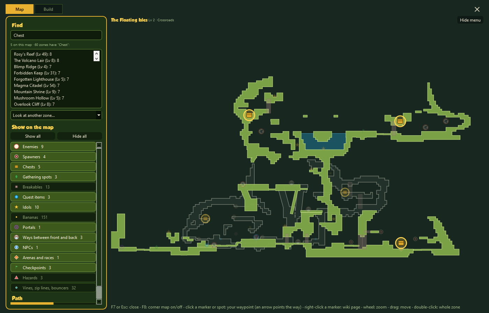
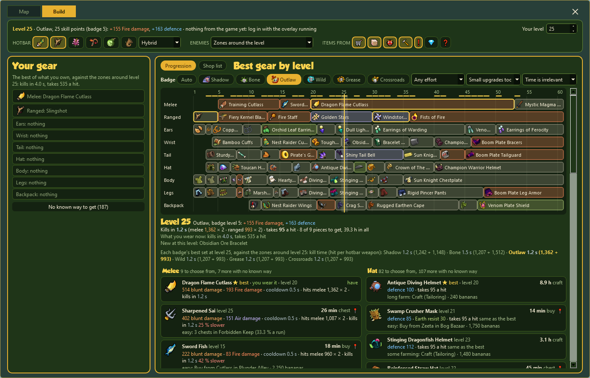

# MonkeyQuest Overlay

A map and build overlay for the Monkey Quest client on MQReborn. It shows the map of the zone you are in, where
you are, an arrow to any spot you pick, and a Build tab that works out the best gear for your character at every
level from what you own.

## What you get

- **A map in the corner of your game (F8)** that follows you around, with enemies, chests, portals and NPCs on it.
- **A full map (F7)** where you can search for anything: an enemy, an item drop, an NPC, a quest item. Click a spot
  and a yellow arrow on your screen points the way, even through other zones.

  

- **A build tab** that looks at what you own and suggests the best gear for every level up to 60, and where to get
  what you're missing.

  

## Is it safe?

The overlay only reads, it never changes anything:

- it reads the game's log file to know which zone you are in,
- it listens to the game's own connection (through [Npcap](https://npcap.com/#download)) for your position and
  your character (level, inventory, gear), in memory only; the only thing saved is your character as numbers and
  item ids,
- it doesn't touch the game's files or memory, doesn't press keys for you and doesn't send anything anywhere.

All the code is here in this repository, and the installer is built by GitHub from exactly this code (see the
Actions tab). Because the program isn't signed yet, Windows and some antivirus programs warn about it the first
time: Windows shows "More info", then "Run anyway"; Norton may scan it and then report nothing found.

This is a fan project. It is not made by the MQReborn team or Nickelodeon.

## Install

**With the installer** (easiest):

1. Download `mq-overlay-…-setup.exe` from the [latest release](https://github.com/whyvnaa/MQROverlay/releases/latest)
   and run it (no administrator needed). It puts MQ Overlay in the Start menu and on the desktop and comes with an
   uninstaller.
2. Install [Npcap](https://npcap.com/#download). The overlay needs it to see where you are and to know your
   character (level, inventory, gear) for the build tab. It walks you through this on first start. Without it the
   maps, the search and the build planner still work.
3. Start MQ Overlay from the desktop. It starts the game for you. Press F8 or F7 in the game.

**Or with [uv](https://docs.astral.sh/uv/)**, if you'd rather run it straight from the code (no installer, no
SmartScreen warning). Install uv once, then run this in any terminal:

```bash
uvx --from git+https://github.com/whyvnaa/MQROverlay mq-overlay
```

The first start downloads the overlay and Qt (about 100 MB, once). Add `--refresh` to get the newest version.
Npcap is needed the same way as above. Or clone the repository and run `uv run mq-overlay` inside it.

Found a bug or have an idea? [Open an issue](https://github.com/whyvnaa/MQROverlay/issues).

## Running it

Windows only (the game is too). The game must run in a window or borderless window: overlays can't draw over
exclusive fullscreen (Alt+Enter in the game switches). The game's install folder doesn't matter.

### Live position (Npcap)

Where you are, the arrow, and your character in the Build tab come from the game's own connection, which the
overlay reads through [Npcap](https://npcap.com/#download). Install it once (keep "Install Npcap in WinPcap
API-compatible Mode" ticked, leave "Restrict Npcap driver's access to Administrators only" unticked). The overlay
tells you at start when Npcap is missing, with the steps and a "Check again" button, so no restart is needed; the
tray menu and the map's header open the same window later. The overlay only listens to the game's connection
(port 9339), in memory: no traffic is logged or saved, only your character's numbers and item ids (see
Settings below).

Without Npcap the maps, the search and the Build tab's planning still work; you just have no position and the
Build tab doesn't know your character.

## One click for both

The overlay starts the game for you: when it starts and the game isn't running yet, it runs "Play MQReborn" (the
patcher, found through the MQReborn installer's registry entry or `C:\MQReborn`). So a desktop icon for MQ Overlay
is all you need. The tray icon's menu switches this off ("Start the game with the overlay") or lets you pick the
program when the game is installed somewhere unusual ("Choose the game…"); `--no-game` skips it once.

## Keys

| Key | What it does |
|---|---|
| **F8** | corner map on/off: a small map in a corner of the game window, click-through, follows you |
| **F7** | full-screen map on/off: covers the game, takes the mouse; Esc closes it too |
| Ctrl+F | the search box on the full-screen map |
| wheel, drag, double-click | zoom, move, whole zone again |
| click a marker or spot | sets your waypoint: a banana-yellow arrow over the game points the way, zone by zone |
| right-click a marker | opens its page on the [Monkey Quest Reborn Wiki](https://whyvnaa.github.io/MQRWiki/) |
| Shift+click | tells the overlay where you are, when there is no live position |

Both hotkeys work while the game has focus. If one is taken by another program, the tray message says so; change
it in the settings file (below) or use the tray icon's menu, which has the same actions.

## The full-screen map

- **Map | Build** at the top switches between the map and the Build tab.
- **Find**: enemy and NPC names, portal targets, quest items and everything chests, gathering spots and enemies
  drop. Matches light up on the map and the list shows every zone with matches; click one to look at its map,
  "Back to …" returns to your zone.
- **Look at another zone**, **Show on the map** (each marker kind on or off, saved) and **Front path | Back path**
  (the path on show; "Find me" zooms to you on your path).
- **Waypoint**: click anywhere. In another zone the arrow points at the portal to take; where a path ends it points
  at the bridge to the other path, using the game's own route data. "Clear waypoint" in the header removes it.

## The Build tab

Your level, bananas, skill points, inventory, hotbar and worn gear come from the game when you log in with the
overlay running (a saved copy is kept, so a restarted overlay still knows you). Then:

- **Your gear** (left): what you wear per slot, and "better in your bag" when something you own would do more.
- **Progression** (middle): the best gear at every level from 1 to 60 for the badge you pick (or Auto), one lane
  per slot. Click a level for its card: the best set and every other item you could wear there, with what it costs
  you against the best, how long it takes to get and the way. 📍 jumps to the place on the map.
- **Shop list**: what is worth looking for now and a few levels above, per tribe and armour group.
- **Item cards** (right): stats, what the item adds to you, how to get it with every zone that has it, other
  upgrades for the slot, and **Exclude** for items you don't want suggested (listed on the left, where you can take
  them back).
- The strip on top: your hotbar (which slots to plan for), the build style (Hybrid, Melee build, Ranged build),
  who you fight, and where items may come from.

The same planner runs on the wiki's [build calculator](https://whyvnaa.github.io/MQRWiki/guides/calculator.html);
the overlay adds your real inventory.

## Settings and options

Settings are in `%LOCALAPPDATA%\MonkeyQuest-Overlay\MQ Overlay\settings.json` (only what differs from the defaults
is saved): `hotkey_fullmap`, `hotkey_minimap` (e.g. `"Ctrl+M"`), `minimap` (on/off), `minimap_corner`
(`top-right`, `top-left`, `bottom-right`, `bottom-left`), `minimap_width` (part of the game width, default 0.16),
`minimap_margin` (pixels from the edges), `minimap_span` (how far the corner map shows around you, in game units;
a game screen is 20), `live_prompt` (the Npcap window at start), `start_game` and `game_exe` (the game
started with the overlay, and which program). Your character is saved next to it as
`character.json` (numbers and item ids only).

Command line: `--zone LV_CRS_Trail01` shows a zone instead of following the log, `--full` opens the full-screen
map right away (works without the game), `--log PATH` reads another log file (the default is the client's
`output_log.txt` under `%LOCALAPPDATA%Low\MQReborn Team\MQReborn`), `--no-live` turns the live position off.
`--snapshot out.png` renders the overlay into a PNG and exits (for testing; `--build LEVEL`, `--own`, `--card`,
`--shop` and more set up the Build tab for it; `--clean` uses the default settings instead of yours, as for the
pictures in `docs/`).

Tests: `uv run pytest`. Release: `uv run --group build tools/build_exe.py --installer` (PyInstaller and Inno
Setup; a tag `v*` on GitHub builds the installer and the zip and attaches them automatically).

## Data

`data/` is generated by the MonkeyQuest knowledge base (its `scripts/export_overlay.py`) from the level files of
the MQReborn client: terrain, invisible walls and the placed objects, joined to its database for names, drop
tables, portal targets and wiki links; the game's own route data per zone; the build planner and its item data.
Portraits are renders of the game's 3D models. Monkey Quest art © Nickelodeon.
